# CSVからFHIRへの変換

このリポジトリでは、CSVからFHIRリソースへ変換後、InterSystems IRIS for Health の FHIRリポジトリにPOSTする流れを確認できます。

以下の2通りの記述方法を用意しています。

- ObjectScriptを利用した変換ロジックの記述方法
- Embedded Pythonを利用した変換ロジックの記述方法

どちらも、FHIRリソースの作成には、[JSONTemplate](https://github.com/Intersystems-jp/JSONTemplate) のFHIR用クラス一式を利用しています。

> **✅ JSONTemplateとは？**
>
> テンプレートクラスに記載された「JSONテンプレート」を元に、JSONの生成を行うクラスで、テンプレートクラスのプロパティを利用して動的な値を設定したり、パラメータを利用して固定値の設定することができるクラスです。
>
> 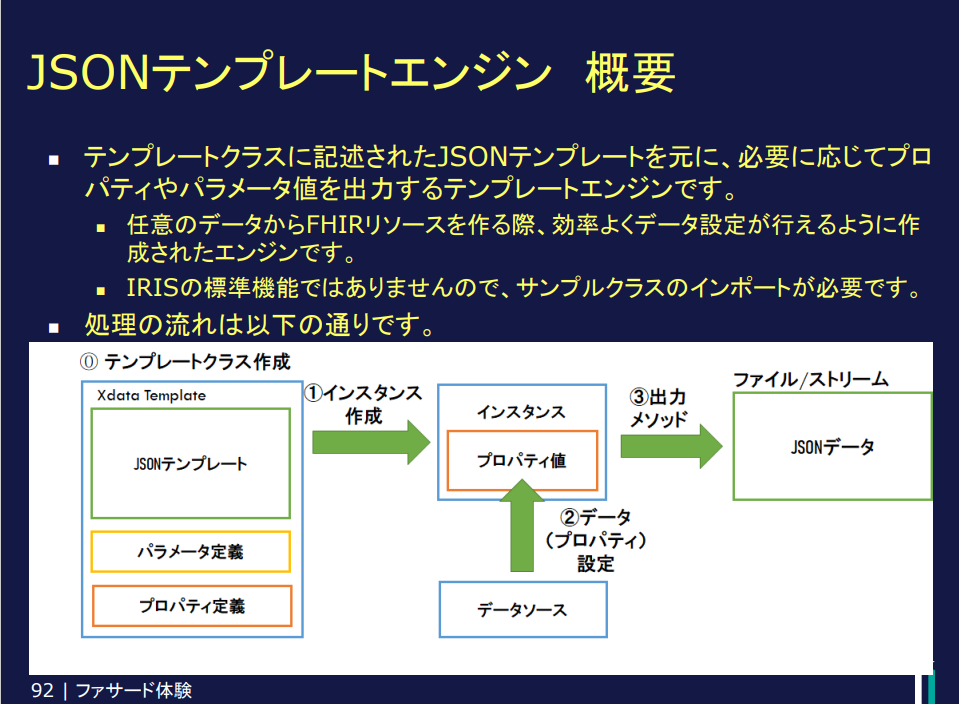
> 
> 複雑なJSONの一部に動的な値を割り当てたい、決まった形式のJSONに値を当てはめたい、などの用途にピッタリのテンプレートクラスです。
> 使い方詳細は、記事もご参照ください：[複雑なJSONの生成に便利な「JSONテンプレートエンジン」の使い方ご紹介](https://jp.community.intersystems.com/node/551396)
>
> ※このクラスはコミュニティサポートのクラスであるため、IRIS for Healthには同梱されていません。インストール環境ごとにご自身でインポートいただく必要があります。
>
> **✅ FHIR用JSONTemplateとは？**
>
> JSONフォーマットで定義されている HL7 FHIR のリソース用に、予めテンプレートのJSONを組み込んだクラス群を提供しています。
> 利用されるプロファイルに合わせてテンプレートのJSONをオーバーライドして加工すれば、プロファイルに合わせたJSONテンプレートクラスに変更できます。
> 
> 🎥詳しく解説している関連ウェビナーもご参照ください：[JSONテンプレートエンジンのご紹介～FHIR JSONフォーマットを簡単生成～](https://www.youtube.com/watch?v=H4LzOV-Tfzg&list=PLzSN_5VbNaxB39_H2QMMEG_EsNEFc0ASz&index=5)
>

【目次】
- [CSVからFHIRへの変換](#csvからfhirへの変換)
  - [1. 変換の流れ](#1-変換の流れ)
    - [1-1. 患者基本情報が含まれるCSVからPatientリソースを作成する流れ](#1-1-患者基本情報が含まれるcsvからpatientリソースを作成する流れ)
      - [💡メモ](#メモ)
    - [1-2. 身長・体重が含まれるCSVからObservationリソースを登録する流れ（複数一括登録）](#1-2-身長体重が含まれるcsvからobservationリソースを登録する流れ複数一括登録)
      - [処理概要](#処理概要)
  - [2. 共通コンポーネント](#2-共通コンポーネント)
    - [2-1. CSVファイル入力](#2-1-csvファイル入力)
    - [2-2. FHIRリポジトリへのHTTP要求](#2-2-fhirリポジトリへのhttp要求)
  - [3. 変換処理](#3-変換処理)
    - [ObjectScriptを利用した変換](#objectscriptを利用した変換)
      - [動かし方](#動かし方)
    - [Embedded Pythonを利用した変換](#embedded-pythonを利用した変換)
      - [動かし方](#動かし方-1)
        - [1. プロダクション設定を変更する](#1-プロダクション設定を変更する)
        - [2. サンプルデータを指定ディレクトリに配置する](#2-サンプルデータを指定ディレクトリに配置する)
  - [コンテナの動かし方](#コンテナの動かし方)
  - [参考情報](#参考情報)


## 1. 変換の流れ

以下2つの流れをご紹介します。（他形式の情報からFHIRリソースのJSONを作成する方法は、ファサードの流れと共通です）


### 1-1. 患者基本情報が含まれるCSVからPatientリソースを作成する流れ

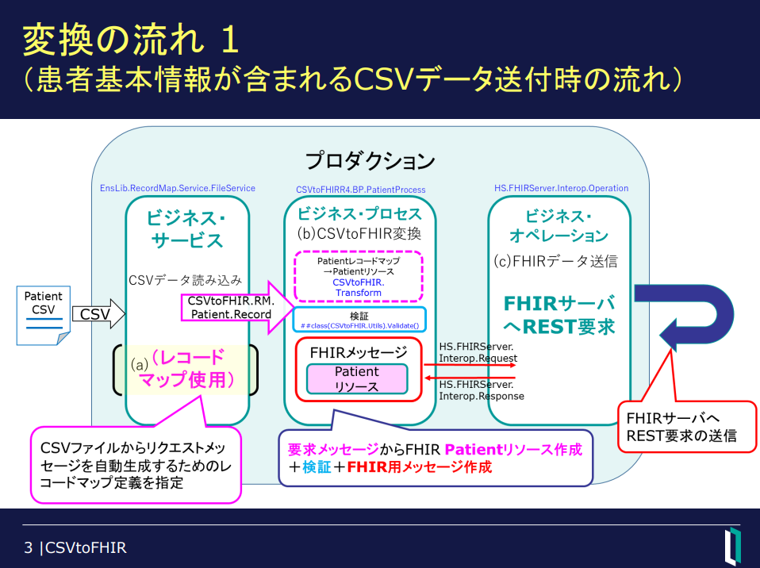

この例では、IRIS の Interoperability が提供する**ファイル入出力をローコードで行えるレコードマップ**を利用して、CSV入力を行っています。

> ご参考：[レコードマップ](https://docs.intersystems.com/irisforhealthlatestj/csp/docbook/DocBook.UI.Page.cls?KEY=EGDV_recmap)

プロセスに送信されたメッセージを一旦JSONに変換し、JSONTeamplateを利用してPatientリソースを作成しています。

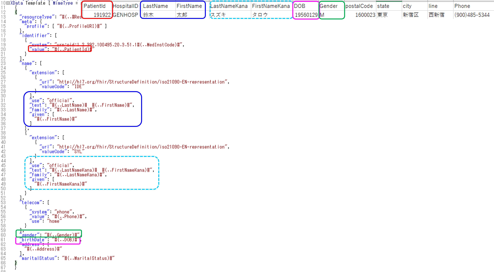

FHIRリポジトリへREST要求を行うオペレーションはシステム提供クラス [HS.FHIRServer.Interop.Operation](https://docs.intersystems.com/irisforhealthlatest/csp/documatic/%25CSP.Documatic.cls?LIBRARY=HSLIB&CLASSNAME=HS.FHIRServer.Interop.Operation) があるので、実行時[HS.FHIRServer.Interop.Request](https://docs.intersystems.com/irisforhealthlatest/csp/documatic/%25CSP.Documatic.cls?LIBRARY=HSLIB&CLASSNAME=HS.FHIRServer.Interop.Request)を渡すだけでFHIRリポジトリに処理を依頼できます。

リポジトリからのレスポンスは、[HS.FHIRServer.Interop.Response](https://docs.intersystems.com/irisforhealthlatest/csp/documatic/%25CSP.Documatic.cls?LIBRARY=HSLIB&CLASSNAME=HS.FHIRServer.Interop.Response)で返送されます。

コースで行う流れでは、CSVのカラムヘッダをテンプレートクラスのプロパティ名に合わせて作成しています（大小文字も含めて合わせています）。
>CSVから作成したメッセージをJSONに変換、変換したJSONを利用してFHIRのPatientリソースを作成しています。

[CSVのサンプルファイル](./data/Step2/Example-InputDataPatient.csv)

#### 💡メモ

レコードマップのクラス定義：[CSVtoFHIR.RM.Patient.Record](./src/CSVtoFHIR/RM/Patient/Record.cls) のスーパークラスには[%JSON.Adaptor](https://docs.intersystems.com/irisforhealthlatestj/csp/docbook/DocBook.UI.Page.cls?KEY=GJSON_adaptor)を追加しています。
```
Class CSVtoFHIR.RM.Patient.Record Extends (%Persistent, %XML.Adaptor, Ens.Request, EnsLib.RecordMap.Base, %JSON.Adaptor) [ Inheritance = right, ProcedureBlock ]
```
このスーパークラスを追加することで、メッセージからJSONへの変換が行えます。

### 1-2. 身長・体重が含まれるCSVからObservationリソースを登録する流れ（複数一括登録）

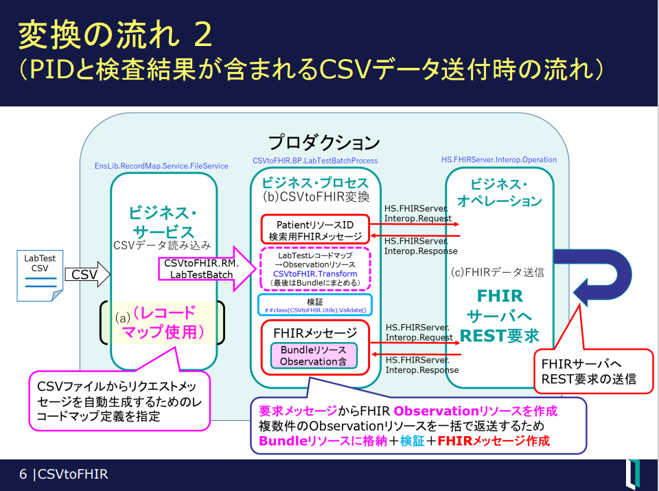

複数行を一括で入力→Observationに変換→複数のObservationリソースをBundleにまとめてPOST要求送信 の流れで処理しています。

サンプル：[Example-InputDataLabTest.csv](./data/Step2/Example-InputDataLabTest.csv)


#### 処理概要

1. Patientリソースの特定
    
    入力されるCSVには、その病院の患者IDをキーに1人の患者に対する複数の検査結果が含まれています。

    処理の最初に、患者IDに対応するリポジトリ上のPatientリソースIDを特定するため、患者IDを検索条件にGET要求を行っています。

    実行するGET要求のURL例は以下の通りです。

    例：`http://localhost:9981/csp/healthshare/r4fhirnamespace/fhir/r4/Patient?identifier=urn:oid:1.2.392.100495.20.3.51.11311234567|191922`

    クエリパラメータの identifierを利用します。

    > ご参考：クエリパラメータの指定方法についても、FHIR標準スキーマで提示されています：[PatientのSearchParameter](https://www.hl7.org/fhir/patient.html#search)

    
    患者IDからGET要求を行っているところ
    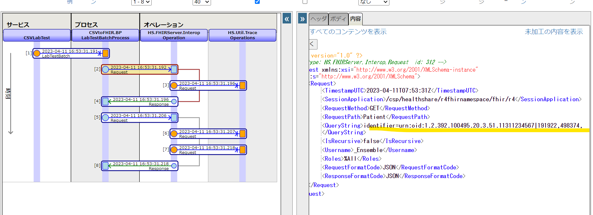


    GET要求の応答
    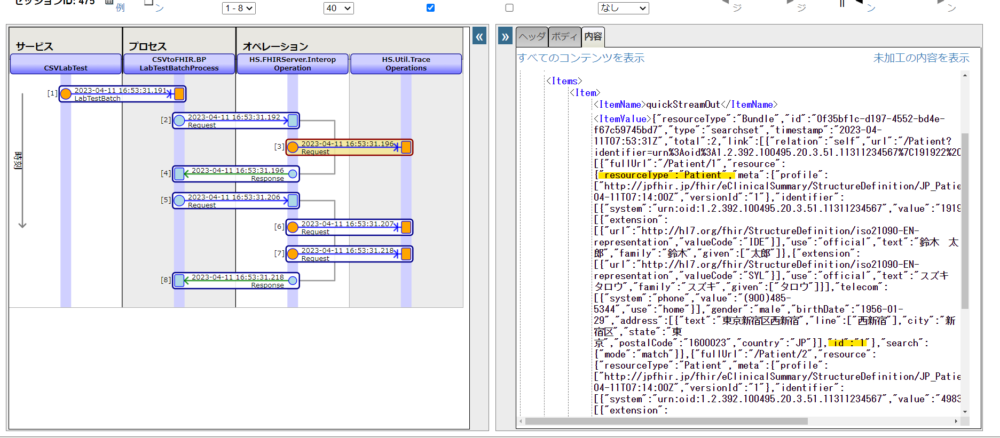

2. Bundleの用意

    1人の患者に対する複数の検査結果を一括で登録するため、Bundleリソースを用意します。また、中に含めるObservationリソースを検査数分用意いします。

    入力したCSVからObservationリソースを作る際のイメージは以下の通りです。
    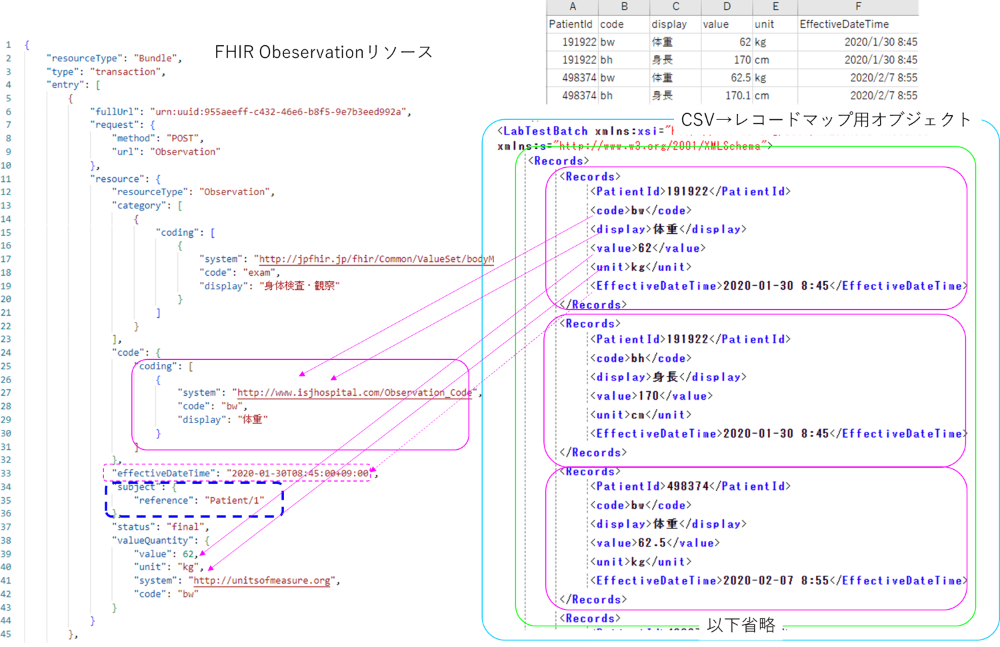

    1の結果で入手したPatientリソースのIDは、**Observation.subject** に reference タイプで設定します。

    POST要求時の送信データ例
    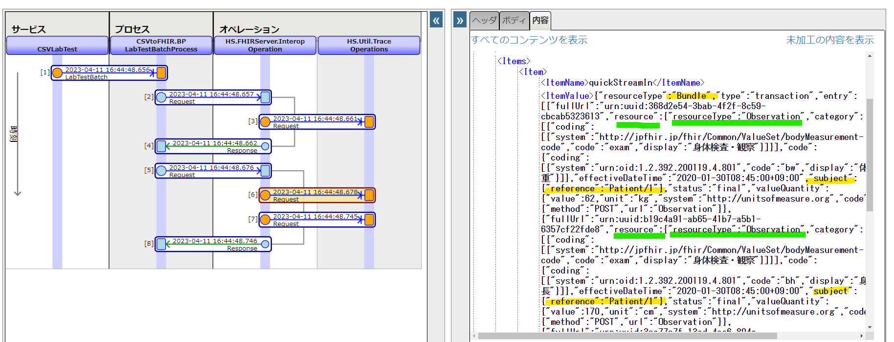

    POST要求の応答例
    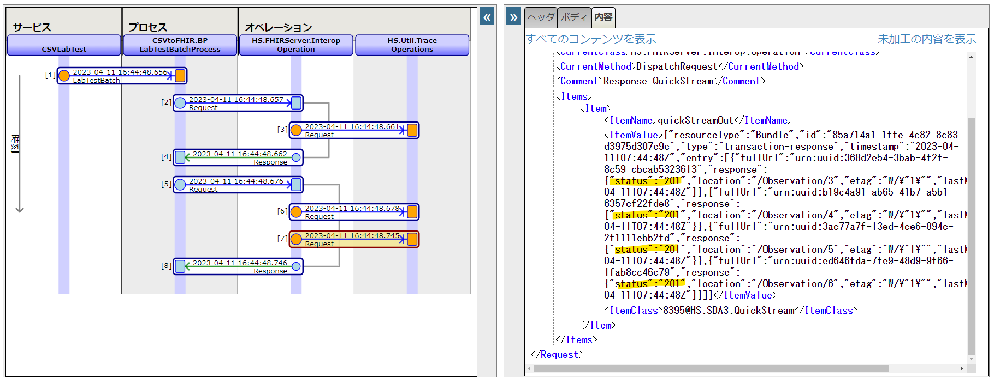


## 2. 共通コンポーネント

以下のコンポーネントは2つの構文で同じものを利用しています。

### 2-1. CSVファイル入力
  
CSVがあれば、そのファイルを利用して、ファイルからメッセージクラスへのマッピングを作成できます。

イメージ：
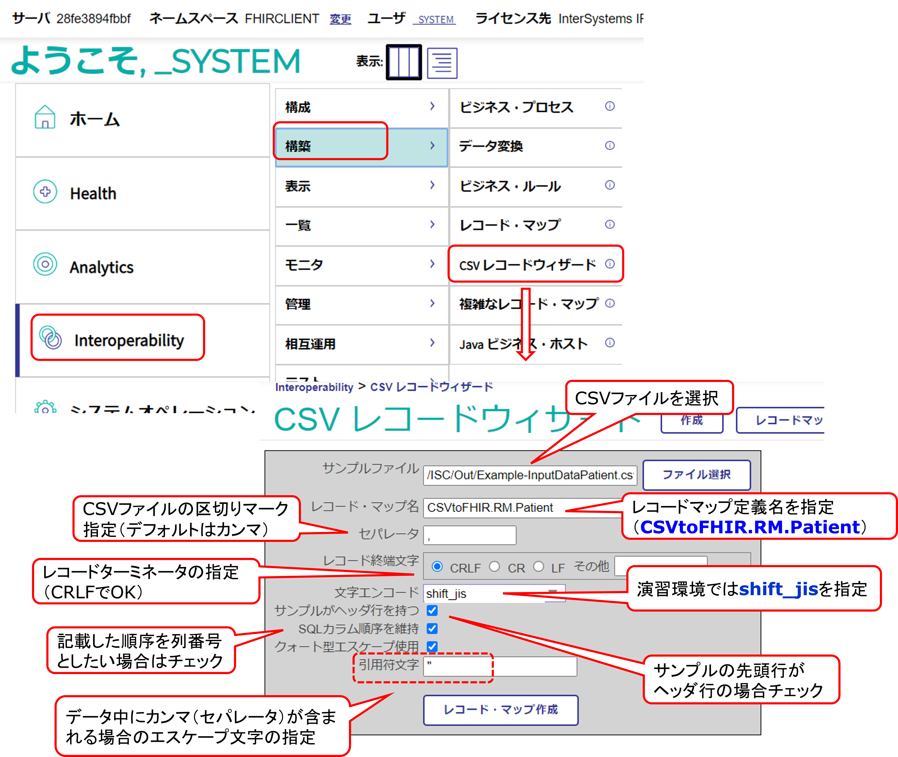

マッピング作成後、システム提供のファイル用レコードマップサービスを利用して、ファイル入力を設定できます。

例）Patient用CSV入力用サービスの設定

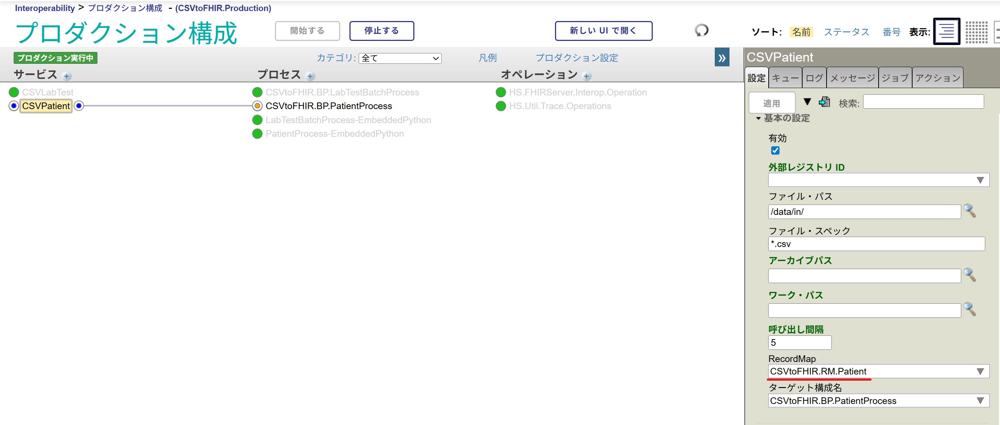


### 2-2. FHIRリポジトリへのHTTP要求

FHIRリポジトリへREST要求を行うため、ビジネスオペレーションを利用しています。

FHIRリポジトリへの要求う用に、システム提供クラス [HS.FHIRServer.Interop.Operation](https://docs.intersystems.com/irisforhealthlatest/csp/documatic/%25CSP.Documatic.cls?LIBRARY=HSLIB&CLASSNAME=HS.FHIRServer.Interop.Operation) があるので、実行時[HS.FHIRServer.Interop.Request](https://docs.intersystems.com/irisforhealthlatest/csp/documatic/%25CSP.Documatic.cls?LIBRARY=HSLIB&CLASSNAME=HS.FHIRServer.Interop.Request)を渡すだけでFHIRリポジトリに処理を依頼できます。

※外部のリポジトリに依頼する場合は、[HS.FHIRServer.Interop.HTTPOperation](https://docs.intersystems.com/irisforhealthlatest/csp/documatic/%25CSP.Documatic.cls?LIBRARY=HSLIB&CLASSNAME=HS.FHIRServer.Interop.HTTPOperation) を利用します。


## 3. 変換処理

FHIRリソースへの変換は、FHIRリソース用のJSONTemplateを利用しています。

以下、それぞれのコード専用に用意したビジネス・プロセスから変換処理を呼び出しています。

- [ObjectScriptを利用した変換](#objectscriptを利用した変換)

- [Embedded Pythonを利用した変換](#embedded-pythonを利用した変換)

### ObjectScriptを利用した変換

処理例：[CSVtoFHIR.TranformクラスのPatient()メソッド](./src/CSVtoFHIR/Transform.cls)
```objectscript
ClassMethod Patient(source As CSVtoFHIR.RM.Patient.Record, ByRef patient As FHIRTemplate.Patient) As %Status
{
    #dim ex As %Exception.AbstractException
    set status=$$$OK
    try {
        //レコードマップのインスタンスをJSONストリームに変換
        $$$ThrowOnError(source.%JSONExportToStream(.jstream))
        //JSONストリームからダイナミックオブジェクトに変換
        set in={}.%FromJSON(jstream.Read())
        set in.DOB=$ZDATEH(in.DOB,8)

        //FHIRTemplate.Patientのインスタンス生成時にデータ割り当て
        set patient=##class(FHIRTemplate.Patient).%New(in)
        //Patient.addressのAddressタイプにデータ割り当て
        set address=##class(FHIRTemplate.DataType.Address).%New(in)
        set patient.Address=address

        //GenderをFHIR R4 Patientリソースに合わせて変更
        set patient.Gender=$select(in.Gender="M":1,1:2)

    }
    catch ex {
        set status=ex.AsStatus()
    }
    return status
}
```


#### 動かし方

Patient用CSV：[InputDataPatient.csv](./data/Step2/InputDataPatient.csv)を [inディレクトリ](./data/in/) に配置すると2件のPatientリソースが登録されます。

確認用のREST要求例は、[fhir2.http](./SampleResource/fhir2.http) をご参照ください。

> VSCodeのエクステンション：[REST Client](https://marketplace.visualstudio.com/items?itemName=humao.rest-client) をインストールするとVSCodeでREST要求を実行できます。

Observation用CSV：[InputDataLabTest.csv](./data/Step2/InputDataLabTest.csv)を [LabTestIn ディレクトリ](./data/LabTestIn/) に配置すると患者それぞれに対して体重・身長のObservationリソースが登録されます。


### Embedded Pythonを利用した変換

処理例：[transform.py](./src/transform.py)

Embedded PythonからIRISに用意したFHIRリソース用テンプレートクラスのインスタンスを生成し、CSVで読み取ったデータを設定しています。

```python
# Patient用の変換クラス
# 引数：レコードマップで作ったメッセージ
# 戻り：Patientテンプレートのインスタンス
def transform_patient(record):

    #ストリームに変換する場合（JSON文字がストリームに格納される）
    stream=iris.ref()
    record._JSONExportToStream(stream)
    #dictに変換：ストリームの場合、JSON文字はstream.value.Read()でとれる
    inputdict=json.loads(stream.value.Read())

    #入力された誕生日を内部日付に変換
    inputdict["DOB"]=iris.system.SQL.TODATE(inputdict["DOB"],"YYYYMMDD")
    #性別の変更（M→1、F→2）
    if inputdict["Gender"] == "M":
        inputdict["Gender"] = 1
    elif inputdict["Gender"] == "F":
        inputdict["Gender"] = 2
    
    # IRISに戻すため、ダイナミックオブジェクトに再度変換
    input=iris._Library.DynamicObject._FromJSON(json.dumps(inputdict))
    # Patientテンプレートのインスタンスを作成
    patient=iris.FHIRTemplate.Patient._New(input)
    #Addressテンプレートクラスのインスタンス化
    address=iris.FHIRTemplate.DataType.Address._New(input)
    patient.Address=address    

    return patient
```

この変換ロジックは、ビジネス・プロセス：[CSVtoFHIR.EP.BP.PatientProcess.cls](./src/CSVtoFHIR/EP/BP/PatientProcess.cls) から要求メッセージ作成を担当する [p_process.py](./src/p_process.py) から呼び出されます。

[p_process.py](./src/p_process.py) の中身：
```python
# 要求メッセージからPatientリソースPOST用要求メッセージを作る関数
# 第1引数：要求メッセージ（レコードマップ）
# 第2引数：FHIRエンドポイント
# 戻り値：応答メッセージ,ステータス
def create_patient(request,endpoint):
    # ステータスOKで初期化
    status=iris.system.Status.OK()
    try:
        # レコードマップ（要求メッセージ）をPatientテンプレートのインスタンスにセット
        patient=transform.transform_patient(request)
        # IRISのダイナミックオブジェクトに変換（参照渡しのためiris.refを使う）
        patient_dynamic=iris.ref()
        status=patient.OutputToDynamicObject(patient_dynamic)
        iris.check_status(status)

        # 検証
        status=iris.CSVtoFHIR.Utils.Validate(patient_dynamic.value)
        iris.check_status(status)

        # QuickStream に作成した Patient リソースを保存
        qs=iris.HS.SDA3.QuickStream._New()
        qsid=qs._Id()
        status=patient.OutputToStream(qs)
        # 先頭に戻す（これ大事）
        qs.Rewind()

        # FHIRリポジトリに送るためのメッセージ作成
        fhirrequest=iris.HS.FHIRServer.Interop.Request._New()
        fhirrequest.Request.RequestMethod="POST"
        fhirrequest.Request.RequestPath="Patient"
        fhirrequest.Request.RequestFormatCode="JSON"
        fhirrequest.Request.ResponseFormatCode="JSON"
        fhirrequest.Request.SessionApplication=endpoint
        fhirrequest.Request.BaseURL=endpoint
        fhirrequest.QuickStreamId=qsid

    except Exception as ex:
        return None,iris.system.Status.Error(5001, str(ex))
    
    return fhirrequest,status


```

[p_process.py](./src/p_process.py)を呼ぶビジネス・プロセスのコードは以下の通り。
```objectscript
Method OnRequest(pRequest As CSVtoFHIR.RM.Patient.Record, Output pResponse As HS.FHIRServer.Interop.Response) As %Status
{
  #dim ex As %Exception.AbstractException
  set status=$$$OK
  try {
    set sys=##class(%SYS.Python).Import("sys")
    do sys.path.append("/src")
    set process=##class(%SYS.Python).Import("p_process")
    // PatientリソースPOST用メッセージ作成
    set result=process."create_patient"(pRequest,..FHIREndpoint)
    // resultはタプルで返ってくるので、応答メッセージとステータスに分ける
    set fhirrequest=result."__getitem__"(0)
    $$$ThrowOnError(result."__getitem__"(1))
    set status=..SendRequestSync(..TargetConfigName,fhirrequest,.pResponse)
    if pResponse.Response.Status'="201" {
      //ステータスエラーを作成してcatchへ移動
      set outcome=##class(HS.SDA3.QuickStream).%OpenId(pResponse.QuickStreamId)
      throw ##class(%Exception.General).%New("FHIR OperationOutcome",,,outcome.Read())
    }
  }
  catch ex {
    set status=ex.AsStatus()
  }
  return status
```

#### 動かし方

**ObjectScript用サンプルCSVとデータを分けています**


##### 1. プロダクション設定を変更する

コンテナ開始後は、ObjectScript用コードが実行されるように設定しています。

[プロダクション設定画面](http://localhost:9981/csp/healthshare/r4fhirnamespace/EnsPortal.ProductionConfig.zen) を開き、2つのビジネスサービスの設定の「ターゲット構成名」を変更します。

- CSVPatient

    ビジネス・サービス：**CSVPatient**を選択し、画面右の設定タブにある「ターゲット構成名」を **PatientProcess-EmbeddedPython** に変更し、適用ボタンを押します。

    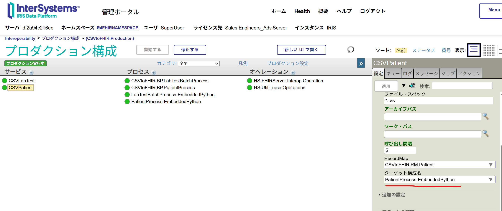

- CSVLabTest
    ビジネス・サービス：**CSVLabTest**を選択し、画面右の設定タブにある「ターゲット構成名」を **LabTestBatchProcess-EmbeddedPython** に変更し、適用ボタンを押します。

    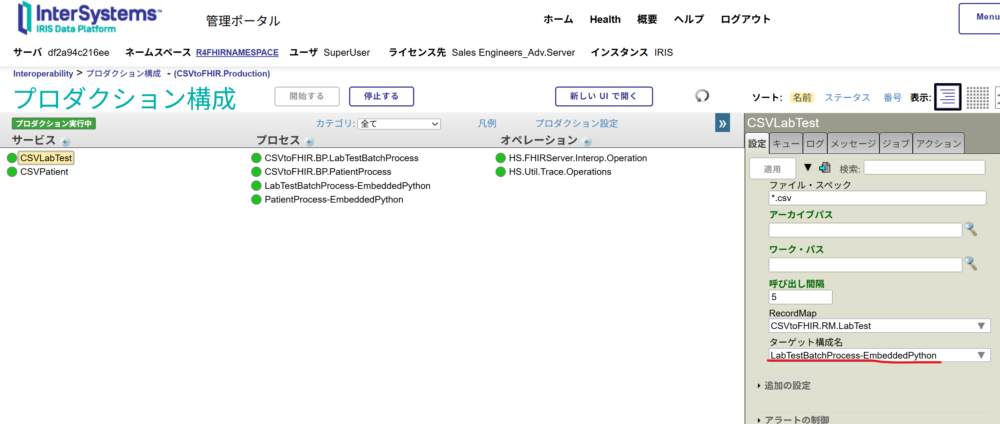


##### 2. サンプルデータを指定ディレクトリに配置する

Patient用CSV：[EP-InputDataPatient.csv](./data/Step2/EP-InputDataPatient.csv)を [inディレクトリ](./data/in/) に配置すると2件のPatientリソースが登録されます。

確認用のREST要求例は、[fhir2.http](./SampleResource/fhir2.http) をご参照ください。

Observation用CSV：[EP-InputDataLabTest.csv](./data/Step2/EP-InputDataLabTest.csv)を [LabTestIn ディレクトリ](./data/LabTestIn/) に配置すると患者それぞれに対して体重・身長のObservationリソースが登録されます。


## コンテナの動かし方

1. [setup.sh](./setup.sh)を実行します。

    コンテナ内でCSVファイルのコピーに利用するディレクトリ準備のため、以下実行します。

    ```
    ./setup.sh
    ```

2. ライセンスキーを配置します。

    リポジトリのルートにiris.keyを配置してください。

3. コンテナをビルドします。

    ```
    docker compose build
    ```

4. コンテナを作成します。

    ```
    docker compose up -d
    ```

5. コンテナの停止・開始

    停止
    ```
    docker compose stop
    ```

    開始
    ```
    docker compose start
    ```

6. コンテナ破棄
    ```
    docker compose down
    ```

    ※ IRISコンテナの機能である、[永続的な%SYS](https://docs.intersystems.com/irisforhealthlatestj/csp/docbook/Doc.View.cls?KEY=AFL_containers#AFL_containers_durable)を使用していないため、コンテナ破棄で作成した内容は全て失われます。リセットしたいときにご利用ください。

## 参考情報

🎥：[Embedded Pythonの自習用ビデオ](https://jp.community.intersystems.com/node/530126)